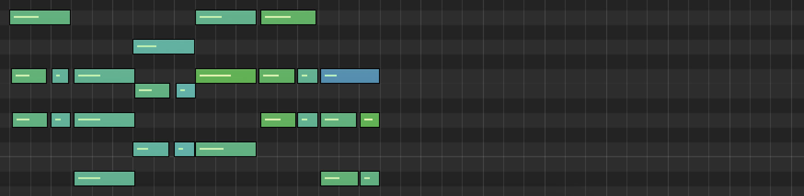
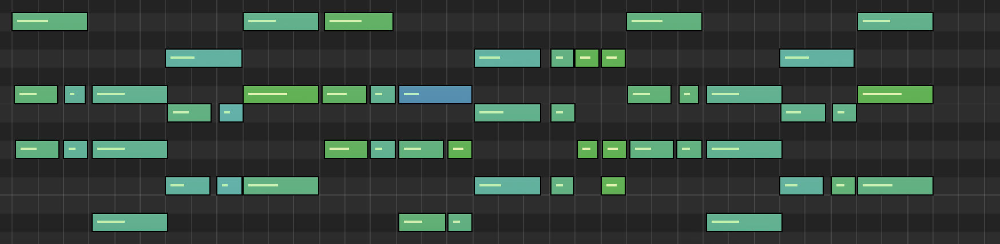

# Music Generator

> Universal model for generating music of diverse genres using MIDI files.

## Table of Contents

* [Introduction](#introduction)
* [Features](#features)
* [Screenshots](#screenshots)
* [Dependencies](#dependencies)
* [Setup](#setup)
* [Usage](#usage)
* [Acknowledgements](#acknowledgements)

## Introduction

- This model is trained on existing MIDI files of a specific genre.
- Afterward it can be used to generate new note sequences for a given input sequence.
- So far only tested with pure piano MIDI samples.

## Features

- Compatible with nearly every music genre
- Variable sequence length
- Infinite note generation

## Screenshots

 
*MIDI sequence for prediction input*

 
*MIDI sequence with prediction output*

## Dependencies

- [MIDI Samples](https://github.com/lucasnfe/adl-piano-midi)
- [TensorFlow](https://www.tensorflow.org)
- mlflow
- music21
- numpy

## Setup

- Use `pip install -r requirements.txt` to install all necessary dependencies.
- Create the empty directories *cache*, *data*, *midi_in*, *midi_out*.
- Gather MIDI files of the desired genre and put them in the *midi_in* directory (each genre in its separate
  sub-directory).
- Run the ML-Flow server
  with `mlflow server --host 127.0.0.1 --port 8080 --no-serve-artifacts --backend-store-uri <PATH>` for logging the
  training process.
- If no logging is needed, disable it when creating a model instance at `model = MusicGen_Model(logging=False)`.

## Usage

- Move to the `src` directory.
- Use `python train.py` (sample contained in the file) to train a model with existing MIDI files.
- Use `python predict.py` (sample contained in the file) to predict new notes to a MIDI file.

## Acknowledgements

This project was inspired by myself, since there was no suitable alternative.

*Original idea in May 2024*
