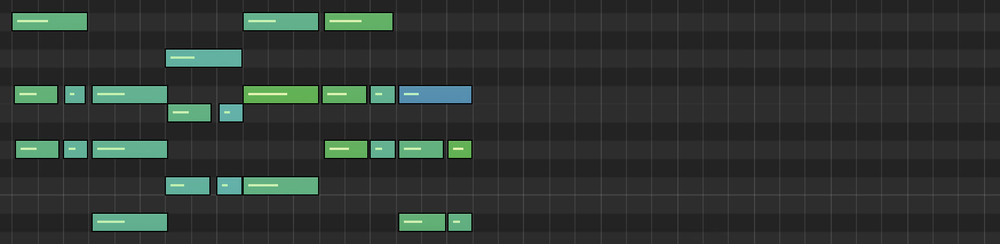
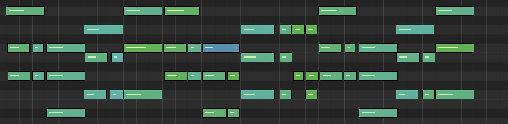

# Music Generator

Neural MIDI generation pipeline built for genre-specific training and sampling.

## Overview

This project trains an LSTM-based NN on existing MIDI files and generates new sequences in a similar style.

## How It Works

1. Parse MIDI files in `data/midi_in/<Genre>`.
2. Extract notes and chords into a token stream.
3. Build fixed-length sequences for next-note prediction.
4. Train an LSTM with an embedding layer and softmax output.
5. Autoregressively sample new notes and write them to a MIDI file.

## Project Structure

- `data/cache` Cached note sets and sequences
- `data/midi_in` Input MIDI files (one subfolder for each genre)
- `data/midi_out` Generated MIDI outputs
- `models/` Saved models and note maps
- `src/music_generator/` Core library code
- `src/run.py` CLI entry point

## Setup

Create a virtual environment and install dependencies:
```
uv sync
```

Place your MIDI datasets in `data/midi_in/<GENRE>` subfolders.

Optional: run the MLflow server and keep it active:
```
mlflow server --host 127.0.0.1 --port 8080 --no-serve-artifacts --backend-store-uri ./mlflow
```

## Usage

Train a model for a specific genre:
```
uv run src/run.py training --genre <GENRE>
```

Generate MIDI sequence for a specific genre:
```
uv run src/run.py inference --genre <GENRE> --model-name <MODEL_NAME>
```

## Screenshots

### MIDI sequence for prediction input


### MIDI sequence with prediction output


## Limitations

- The current tokenization treats chords as "pitch1:pitch2:..." strings.
- Timing between notes is not yet modeled. Duration is kept, but inter-note delay is not used.
- The model is tuned for piano-style MIDI and may require filtering for other instruments.
